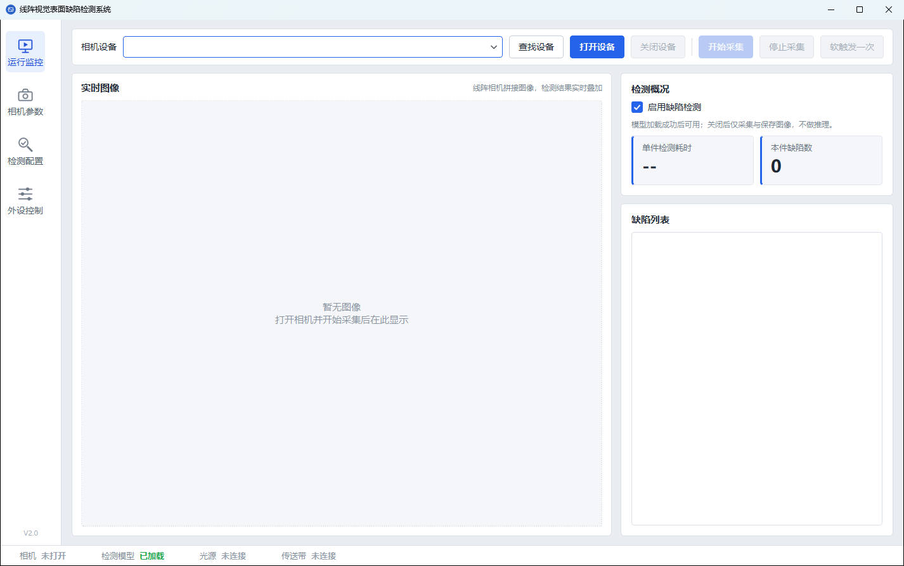
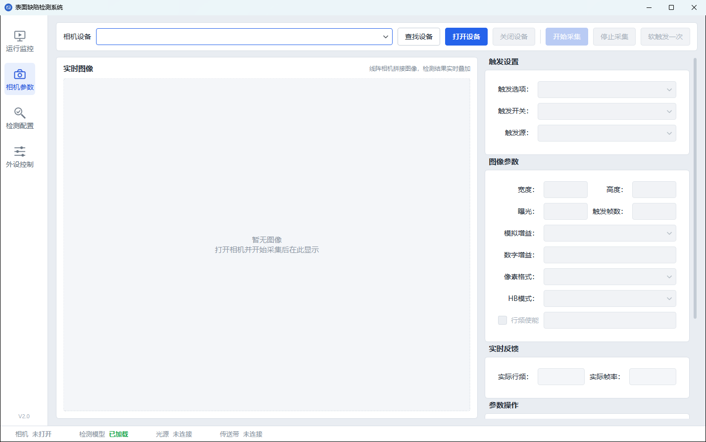
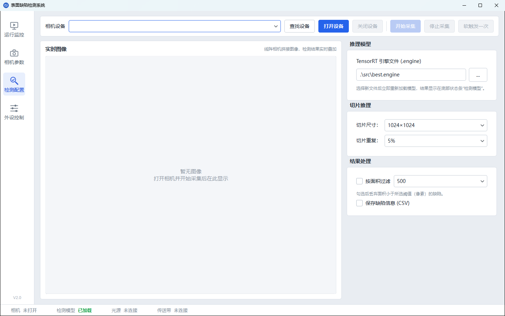
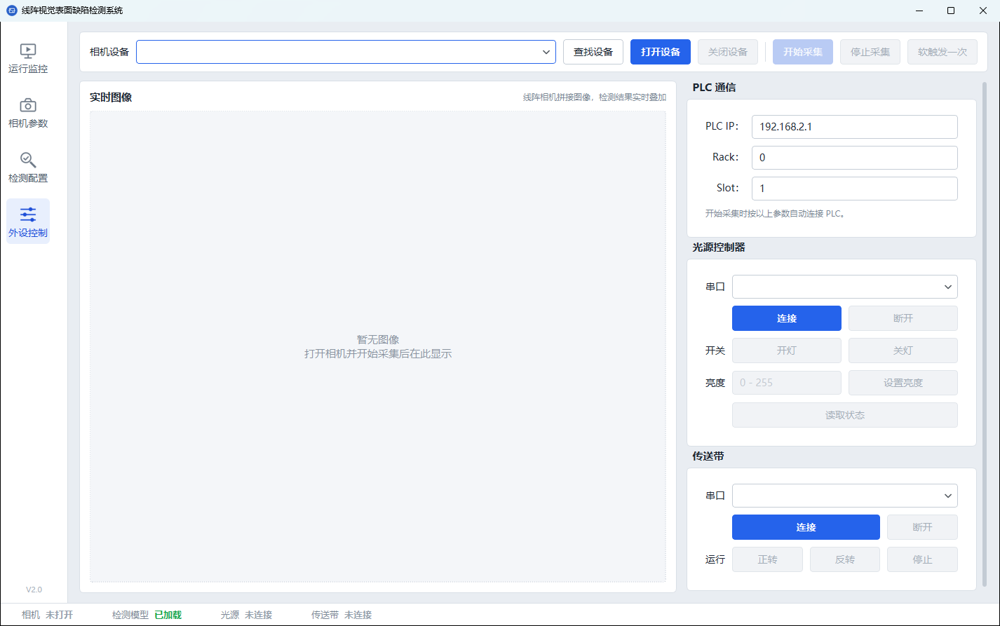
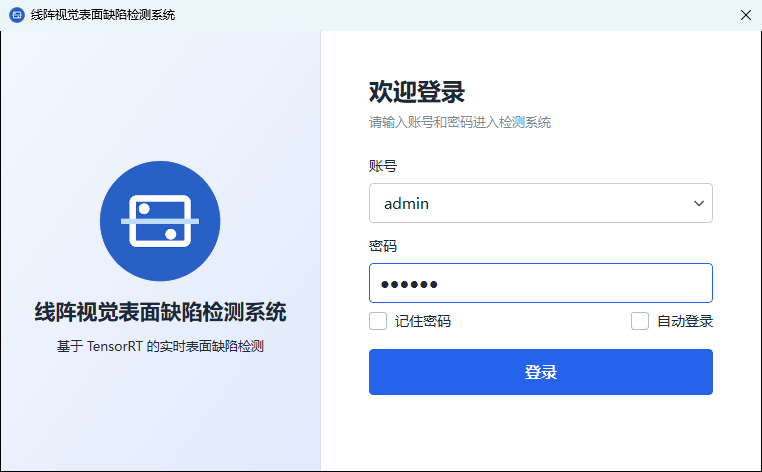
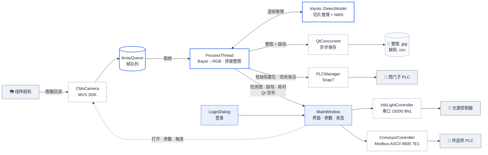

# 🪵 HIKONCam

一个基于 Qt 的板材表面缺陷在线检测程序，运行在 Windows x64 上 🖥️

用海康 MVS SDK 驱动线阵相机采图，TensorRT-YOLO 在 GPU 上实时推理，检出缺陷后通过 Snap7 通知西门子 PLC；光源和传送带走串口控制。

> 📦 仓库只有源码和界面资源。第三方 SDK、模型权重和样例图像都不包含，请按下文自行准备。

## ✨ 功能

- 📷 **相机**：枚举 / 打开 / 关闭设备，调整触发、曝光、增益、行频、像素格式、HB 压缩、宽高和触发帧数，支持软触发；可从相机 UserSet1 加载参数。
- 🧩 **采集拼接**：帧进入线程安全队列，处理线程做 Bayer 转 RGB，凑够“触发帧数”后拼成整图，按 `yyyy-MM-dd-HH-mm-ss-zzz.jpg` 保存。
- 🔍 **缺陷检测**：加载 `.engine` 模型逐帧推理并画框；大图按 512 / 1024 / 2048 切片推理（重叠 5%～50%），合并后统一 NMS。仅对 `BayerRG8` 和 `RGB8Packed` 生效。
- 📋 **结果处理**：按面积过滤小目标，缺陷列表显示类别和毫米尺寸；可按天追加写入 `defects_yyyy-MM-dd.csv`。
- 🏭 **PLC**：开始采集时按界面上的 IP / Rack / Slot 自动连接（默认 `192.168.2.1` / `0` / `1`）。发现缺陷时把 DB1.DBX8080.0（S7-200 SMART 的 V8080.0）置 1，复位交给 PLC 程序；空闲超过 4000 ms 会读一次做保活。
- 💡 **光源**：海康光源控制器，19200 波特 8N1，支持开关、亮度（0～255）和状态读取。
- 🚚 **传送带**：Modbus ASCII，9600 波特 7E1，站号 1，M1 正转、M2 反转、可停止。地址按台达 DVP-48EH 编写，其他型号改 `ConveyorController.h` 里的常量即可。
- 🔐 **登录**：支持记住密码和自动登录，配置存于 `<exe 目录>/../config/login.ini`。

底部状态条实时显示相机、模型、光源、传送带状态；左侧导航切换“运行监控 / 相机参数 / 检测配置 / 外设控制”四页，图像区始终可见。

## 📸 界面预览



| 相机参数 | 检测配置 |
| --- | --- |
|  |  |
| **外设控制** | **登录** |
|  |  |

## 🏗️ 架构



程序分 4 类线程，互不阻塞：

- 📥 **相机回调线程**（MVS SDK）：只负责把帧写进 `ArrayQueue`。
- ⚙️ **ProcessThread**：取帧、推理、拼接，整板检完后通过 PLC 发出信号；PLC 连接也在这个线程里建立。
- 💾 **线程池**（QtConcurrent）：异步写 JPG 和 CSV，不拖慢检测。
- 🖥️ **主线程**：界面、光源和传送带串口；检测结果经 Qt 信号回到这里显示。

## 🧰 环境与依赖

以下组合在 Windows 10/11 x64 上验证可用。Qt、VS、CUDA、TensorRT、MVS 装在系统里，其余放在项目根目录：

| 组件 | 版本 | 获取 | 放置位置 |
| --- | --- | --- | --- |
| Visual Studio | 2022（C++ 桌面开发） | Microsoft 官网 | 系统安装 |
| Qt | 6.11.1 MSVC2022 64-bit + Qt Serial Port | [Qt 在线安装器](https://www.qt.io/download-qt-installer) | 系统安装 |
| CUDA Toolkit | 12.8 | [CUDA Toolkit Archive](https://developer.nvidia.com/cuda-toolkit-archive) | 系统安装 |
| TensorRT | 10.10.0.31（Windows zip） | [NVIDIA TensorRT](https://developer.nvidia.com/tensorrt) | 任意目录，下文记作 `<TensorRT>` |
| 海康 MVS SDK | 随 MVS 客户端 | [海康机器人下载中心](https://www.hikrobotics.com/cn/machinevision/service/download/) | 头文件 → `includes/`，`MvCameraControl.lib` → `lib/` |
| OpenCV | 4.11.0 预编译包 | [Release 4.11.0](https://github.com/opencv/opencv/releases/tag/4.11.0) | 解压为 `opencv/` |
| Snap7 | 1.4.2 | [SourceForge](https://sourceforge.net/projects/snap7/files/1.4.2/) | 解压为 `snap7-full-1.4.2/` |
| TensorRT-YOLO | 6.4.0，源码编译 | [GitHub](https://github.com/laugh12321/TensorRT-YOLO) | 安装到 `TRTYOLO/` |

💡 MVS 默认把头文件装在 `C:\Program Files (x86)\MVS\Development\Includes`，64 位库在 `...\Development\Libraries\win64`。

## 🔨 构建

1. 装好上表中的系统组件，并把 MVS、OpenCV、Snap7 放到对应目录。
2. 在 “x64 Native Tools Command Prompt for VS 2022” 里编译 TensorRT-YOLO（需 CMake ≥ 3.18）：

   ```bat
   git clone https://github.com/laugh12321/TensorRT-YOLO.git
   cd TensorRT-YOLO
   cmake -S . -B build -D TRT_PATH=<TensorRT> -D CMAKE_INSTALL_PREFIX=<项目根目录>/TRTYOLO
   cmake --build build -j --config Release --target install
   ```

   完成后 `TRTYOLO/` 下应有 `include/trtyolo.hpp`、`lib/trtyolo.lib`、`lib/custom_plugins.lib` 和 `bin/*.dll`。

3. 用 Qt Creator 打开 `HIKONCam.pro`，选 Desktop Qt 6.11.1 MSVC2022 64bit 套件，用 **Release** 构建（TensorRT-YOLO 也是 Release 编的）。

## 🧠 模型准备

仓库不带权重，请用自己的数据训练 YOLO 检测模型，再导出成 TensorRT 引擎。⚠️ `.engine` 和 GPU 型号、TensorRT 版本绑定，必须在目标机器上用相同版本生成：

```bat
pip install ultralytics trtyolo-export onnx==1.17.0
yolo export model=best.pt format=onnx imgsz=640 batch=1 dynamic=False simplify=True
trtyolo-export -i best.onnx -o best-trtyolo.onnx -s
trtexec --onnx=best-trtyolo.onnx --saveEngine=best.engine --fp16
```

固定 `onnx==1.17.0` 是为了避开安装时的构建失败；`trtexec` 在 `<TensorRT>\bin` 下。

把 `best.engine` 放到 `src/best.engine`（界面默认路径），或在“检测配置”页另选。找不到模型时程序照常启动，只是检测开关不可用、底部状态条显示“未加载”。

换成自己的模型后，记得改 `processthread.cpp` 里的类别名：`classNames`（英文，`drawDetectionBoxes()` 和 `saveDefectsToCSV()` 各一份）和 `classNamesChinese`（中文）。毫米换算系数 `PIXEL_TO_MM` 也要按实际光路标定。

## 🚀 运行

先把这些目录加入 `PATH`：

- `<项目根目录>\opencv\build\x64\vc16\bin`
- `<项目根目录>\TRTYOLO\bin`
- `<TensorRT>\lib`
- CUDA 和 MVS 的运行库目录（安装程序一般已配好）

在 Qt Creator 的“项目 → 运行”里，把工作目录设为项目根目录，因为模型路径和保存路径 `.\Image` 都是相对它解析的。程序不会自动建目录，请先手动创建 `Image/`。脱离 Qt Creator 运行时，用 `windeployqt` 拷贝 Qt 运行库即可。

🔑 默认账号 `admin`，密码 `123456`，正式部署前记得改掉。

使用流程：登录 → 自动查找设备 → “相机参数”页打开相机并调参 → “检测配置”页确认模型和保存设置 → “外设控制”页连接 PLC、光源、传送带 → 开始采集 🎉

## 📁 目录结构

```text
HIKONCam/
├── main.cpp                      # 入口：先登录，再进主窗口
├── mainwindow.cpp/.h/.ui         # 主窗口
├── logindialog.cpp/.h/.ui        # 登录对话框
├── processthread.cpp/.h          # 取帧、检测、拼接、保存、PLC 信号
├── arrayqueue.cpp/.h             # 线程安全帧队列
├── MvCamera.cpp/.h               # MVS SDK 封装
├── PLCManager.cpp/.h             # Snap7 读写
├── HikLightController.cpp/.h     # 光源串口协议
├── ConveyorController.cpp/.h     # 传送带 Modbus ASCII
├── HIKONCam.pro                  # qmake 工程
├── src/ui/                       # 界面图标
├── src/best.engine               # 自行生成
├── docs/images/                  # README 截图
├── includes/  lib/               # 自行从 MVS 复制
├── opencv/  snap7-full-1.4.2/    # 自行下载
├── TRTYOLO/                      # 自行编译安装
└── Image/                        # 自行创建，默认保存目录
```

## 📜 许可证

本项目以 [GPL-3.0](LICENSE) 协议开源。

依赖的第三方组件各有许可，使用和分发时请一并遵守：

| 组件 | 许可 |
| --- | --- |
| [TensorRT-YOLO](https://github.com/laugh12321/TensorRT-YOLO) | GPL-3.0（分发链接它的二进制时需满足 GPL-3.0） |
| [trtyolo-export](https://pypi.org/project/trtyolo-export/) | GPL-3.0，仅用于导出 |
| [Ultralytics](https://github.com/ultralytics/ultralytics) | AGPL-3.0 或商业许可，仅用于训练与导出 |
| [Snap7](https://snap7.sourceforge.net/) | LGPL-3.0，源码编译进程序 |
| [OpenCV](https://github.com/opencv/opencv) | Apache-2.0 |
| [Qt](https://www.qt.io/) | LGPL-3.0 / GPL / 商业许可 |
| CUDA、TensorRT | NVIDIA 软件许可协议 |
| 海康 MVS SDK | 海康机器人软件许可 |

`MvCamera.cpp/.h` 基于 MVS SDK 自带的示例代码。

## 👤 作者

[DawnJson](https://github.com/DawnJson) · DawnJson@users.noreply.github.com

欢迎提 Issue 和 PR 🙌
